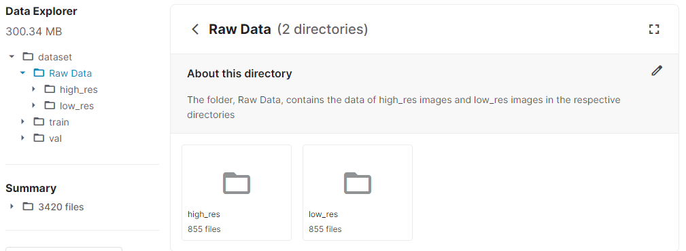

# Image Super Resolution Dataset
 

## Context

While dealing with data for any computer vision problem, one of the main issues that we might face is the low quality of images that we come across. The data provided in this dataset can be used to develop a model that can be used to improve the resolution of images.

## Content

The dataset is divided into 2 main folders: train and val. Inside these 2 folders, there are subdirectories called high_res & low_res which correspond to high-resolution images and low-resolution images respectively.

## Inspiration

When I started learning about image processing, there was a huge need to improve the resolution & quality of these images. So, I decided to look around to find a dataset so that I can develop a model to improve these factors in an image and there was no proper dataset available.

The dataset can be found [here](https://www.kaggle.com/adityachandrasekhar/image-super-resolution)

A basic Tensorflow Implementation of how this dataset could be used can be found [here](https://www.kaggle.com/adityachandrasekhar/basic-tensorflow-implementation)

## Contributions

Create an Issue to this repository or start a discussion in kaggle detailing your ideas to improve the dataset. Once finalised, editing privileges will be provided. 
